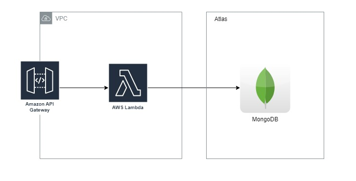

# techchallenge-lambda-authorizer
Repositório do lambda responsável pela geração do token - solução Techchallenge

## Diagrama de Arquitetura:

A lambda esta exposta em um [API Gateway](https://github.com/gustavozenke/techchallenge-infra/blob/main/src/9-apigateway.tf) e é acessada através das rotas:

- [GET] token-generator
- [GET] token-generator/{cpf}

A lambda então consulta o cpf do cliente em nossa base de clientes para validar se o mesmo já possui cadastro. Caso o cpf do cliente esteja cadastrado, a lambda gera o token JWT com base no CPF do cliente e retorna ao Gateway. Caso o cpf do cliente não esteja cadastrado, a lambda retorna status 404 - Cliente não encontrado. Ainda existe a possibilidade de não enviar o CPF do cliente na chamada (cliente preferiu não se identificar), e neste caso o token é gerado a partir de um valor default, ao invés de utilizar o CPF do cliente. 

## Terraform e Github Actions
Como uma forma de facilitar a implantação, manutenção e a atualização de recursos na nossa infraestrutura, utilizamos o Terraform como IAC (_Infrastructure as Code_), além do deploy realizado de forma automática utilizando o Github Actions.